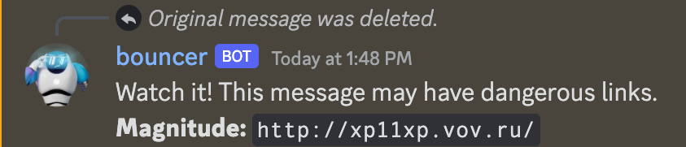
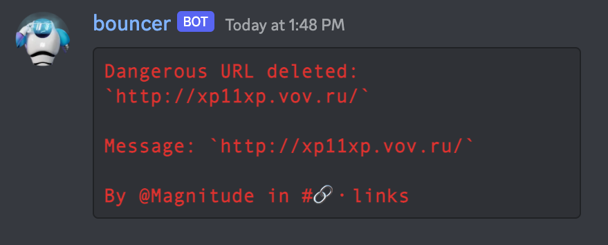

# Bouncer


Bouncer is an open-source Discord bot that scans your server for malicious 
links and neutralizes them. It does this by querying our database of 
known-malicious sites. If the site is new, we use our proprietary visual 
AI to identify 0-day phishing sites. Setup takes just a minute or two and 
it begins protecting your server instantly.

Bouncer is a project of [Interlock](https://www.interlock.network/), 
a web3 company that is decentralizing security. It's free to use in 
exchange for an occasional Interlock partnership post. In the future,
Bouncer will be powered by $ILOCK, Interlock's token
launching later this year. The repo is right here at
[https://github.com/interlock-network/bouncer](https://github.com/interlock-network/bouncer).

You can check out our [FAQ](https://interlock-network.github.io/bouncer/) for more information.

# Status

Bouncer is in beta. It occasionally shows false positives -- safe links marked as dangerous. We're also adding new features all the time.

# How to get Bouncer

[Invite Bouncer](https://discord.com/api/oauth2/authorize?client_id=982020138352128070&permissions=534723951680&scope=bot) to your server like any other bot (along with its recommended permissions) and your public channels will instantly be protected!

Your next step is to create a private channel called `#bouncer-log` and invite Bouncer to it. For more info on logging, see "Channel for Bouncer activity log" below.

# Testing

To test if Bouncer is working, post the following
known-unsafe link in a channel Bouncer is monitoring: `http://xp11xp.vov.ru/`

Your message should immediately be deleted and Bouncer should post the following:

```
Watch it! This message may have dangerous links. NAME: http://xp11xp.vov.ru/
```

Here's a screenshot of the expected behavior:



# Channel for Bouncer activity log

Bouncer logs its activity to a channel called "#bouncer-log". You must manually create this channel and invite Bouncer to it. There you can see when:

- Bouncer deletes a malicious URL, complete with:
  - The malicious URL
  - The message it was in (for context)
  - Username and channel it was posted in
- A mod adds to an allowlist (or removes from one)
- A mod blocks all URLs from a channel (or vice versa)



# Adding to the allowlist

The allowlist is a set of URLs that are marked as safe by a server. In
order to add an element to the allowlist invoke the following command:

`/add_to_allowlist url1.com url2.com`

where `url1.com` and `url2.com` represent URLs that you wish to add to
the allowlist. Allowlists are not shared between servers.

Simply use

`/remove_from_allowlist url1`

to remove a URL from the allowlist.

# Block all links in a channel

To block all URLs in a channel, use `/block_links`:

`/block_links`

To cancel this action and allow URLs again in a channel, use `/unblock_links`:

`/unblock_links`

# Flowchart

The flowchart below will give you an idea of how Bouncer works.


# Important files

To understand what Bouncer does in code, the best place to start is in `source/bouncer.py` .

# Infrastructure

Bouncer clients are run on Interlock's DigitalOcean droplet.

# Maintainer

The maintainer for Bouncer is [@jmercouris](https://github.com/jmercouris).
