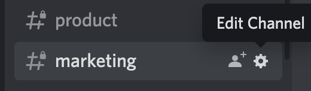
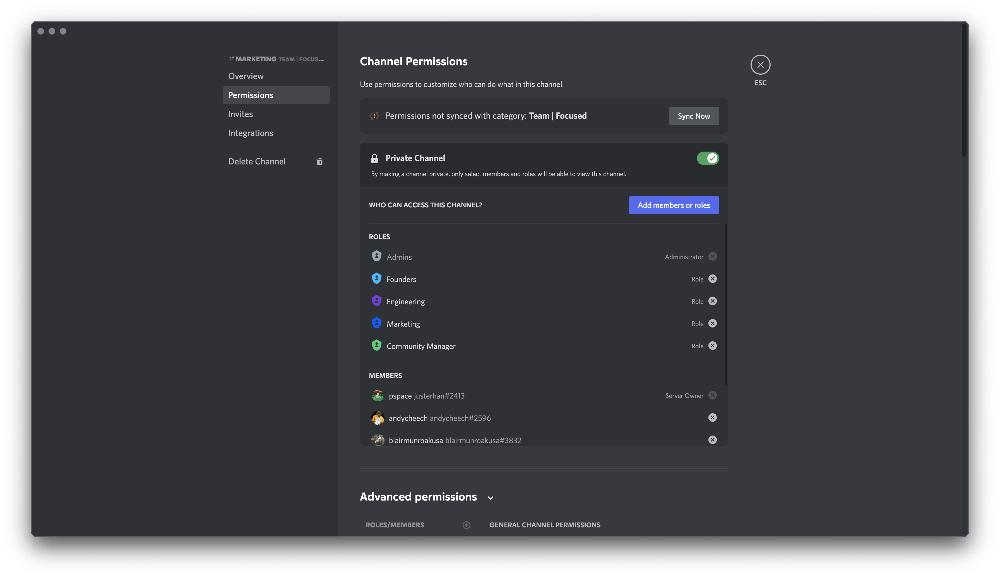

<!-- @format -->


<!-- @format -->

# Interlock-Bouncer FAQ

### What is Bouncer? How does it work?

Interlock-Bouncer is an open-source Discord bot that scans your server for malicious links and neutralizes them. It does this by querying our database of known-malicious sites. If the site is new, we use our proprietary visual AI to identify 0-day phishing sites. Setup takes just a minute or two and it begins protecting your server instantly.

### Who makes Bouncer?

Interlock-Bouncer is a project of [Interlock](https://www.interlock.network/), a web3 company that is decentralizing security.

### Is Bouncer in beta?

It's actually in alpha. That means it is not feature complete and is still buggy. The main challenge now is a relatively high number of false positives -- safe sites incorrectly categorized as unsafe.

### How much does Bouncer cost?

While in testing, Bouncer is free to use in exchange for an occasional Interlock partnership post. In the future, Interlock-Bouncer will be powered by $ILOCK, Interlock's token launching later this year.

### Where can I see the source code?

The Bouncer repo is at [https://github.com/interlock-network/interlock-bouncer](https://github.com/interlock-network/interlock-bouncer) . The pipeline that scans URLs is proprietary, because if hackers could read the code they could figure out new ways to circumvent it.

### Do I have to install any software to get Bouncer running?

No! Interlock-Bouncer clients are run on Interlock's AWS EC2 instances in the us-west-2 region.

### How can I get Bouncer for my Discord server?

To get Bouncer for your server, email dan@interlock.network. You can also message Magnitude on the [Interlock Discord](https://discord.gg/ezraXYD8).

### How do I get Bouncer to protect a channel?

First, click on settings for the channel.



Then, invite Bouncer to the channel and give it Admin access. That's so Bouncer can delete unsafe messages and do what it needs to protect the channel.



### I've installed Bouncer! How can I make sure it's working as expected?

Post the following known-unsafe link in a channel Interlock-Bouncer is monitoring:
`http://phishing.com`

Your message should immediately be deleted and Interlock-Bouncer
should post the following:

```
Message contains dangerous links! NAME: http://phishing.com
```

Here's a screenshot of the expected behavior:


### What's an allowlist? How can I add to my server's allowlist?

The allowlist is a set of URLs that are marked as safe by a server. In
order to add an element to the allowlist invoke the following command:

`!allow_domains url1.com url2.com`

where `url1.com` and `url2.com` represent URLs that you wish to add to
the allowlist. Allowlists are not shared between servers.

### How can I remove URLs from the allowlist?

Simply type `!unallow_domains url1.com` to remove just `url1.com` from the allowlist.

### Can you show me a flowchart of how Bouncer works?

I'm glad you asked. The flowchart below will give you an idea of how Interlock-Bouncer works.


