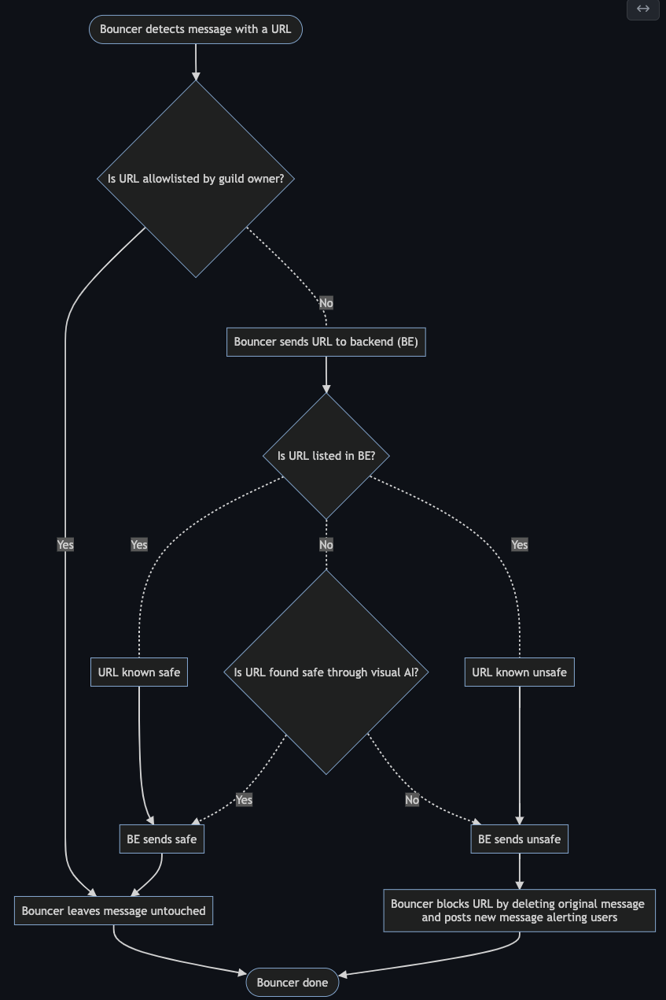

<!-- @format -->

# Interlock-Bouncer


Interlock-Bouncer is a Discord bot that scans your server for malicious links and neutralizes them. It does this by querying our database of known-malicious sites. If the site is new, we use our proprietary visual AI to identify 0-day phishing sites. Setup takes just a minute or two and it begins protecting your server instantly.

Interlock-Bouncer is a project of [Interlock](https://www.interlock.network/), a web3 company that is decentralizing security. It's free to use in exchange for an occasional Interlock partnership post. In the future, Interlock-Bouncer will be powered by $ILOCK, Interlock's token launching later this year. The repo is at [https://github.com/interlock-network/interlock-bouncer](https://github.com/interlock-network/interlock-bouncer) .

# Status

Warning: Interlock-Bouncer is in alpha. The current implementation results
in occasional false positives -- safe links marked as dangerous.

# Authorizing for your server

Interlock-Bouncer is in beta. If you are a beta user, contact us for
the URL to authorize Interlock-Bouncer to run on your own server.

# Testing

To test if Interlock-Bouncer is working, post the following
known-unsafe link in a channel Interlock-Bouncer is monitoring:
`http://phishing.com`

Your message should immediately be deleted and Interlock-Bouncer
should post the following:

```
Message contains dangerous links! NAME: http://phishing.com
```

Here's a screenshot of the expected behavior:


# Adding to the allowlist

The allowlist is a set of URLs that are marked as safe by a server. In
order to add an element to the allowlist invoke the following command:

`!allow_domains url1.com url2.com`

where `url1.com` and `url2.com` represent URLs that you wish to add to
the allowlist. Allowlists are not shared between servers.

# Flowchart

The flowchart below will give you an idea of how Interlock-Bouncer works.



# Important files

To understand what Interlock-Bouncer does in code, the best place to start is in `source/bouncer.py` .

# Infrastructure

Interlock-Bouncer clients are run on AWS EC2 instances in the us-west-2 region.

# Maintainer

The maintainer for Interlock-Bouncer is [@jmercouris](https://github.com/jmercouris).
